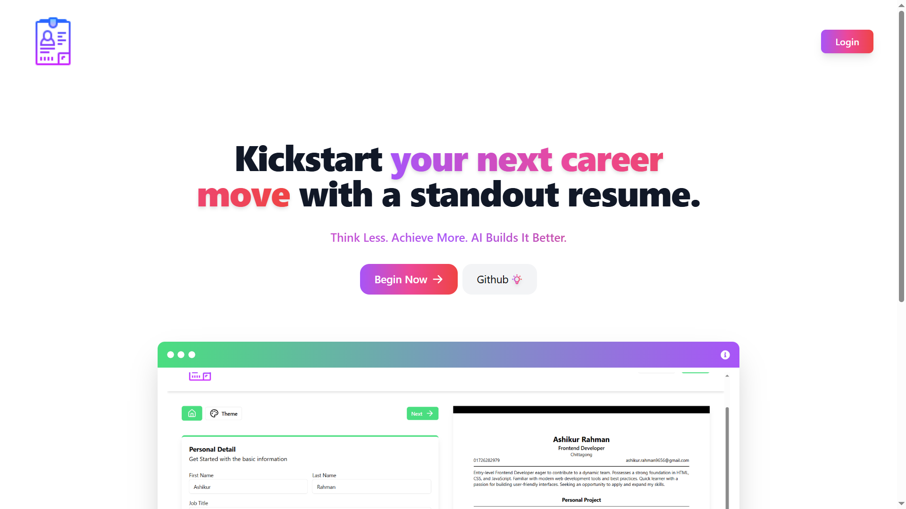
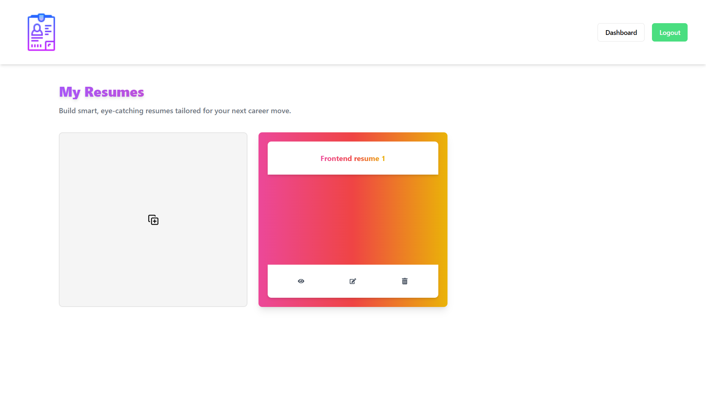
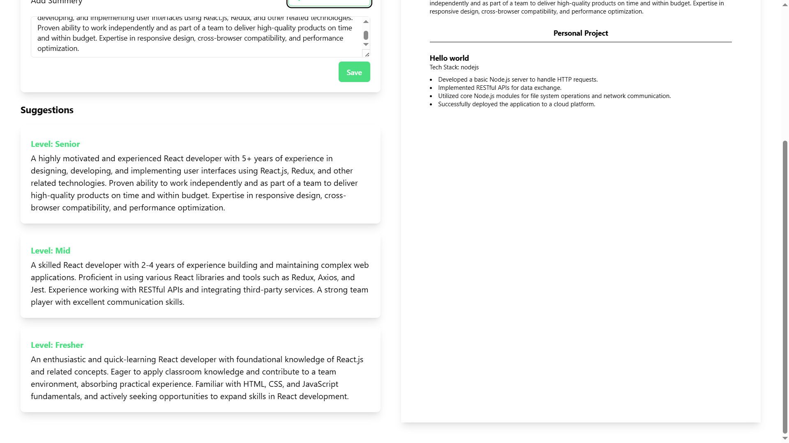
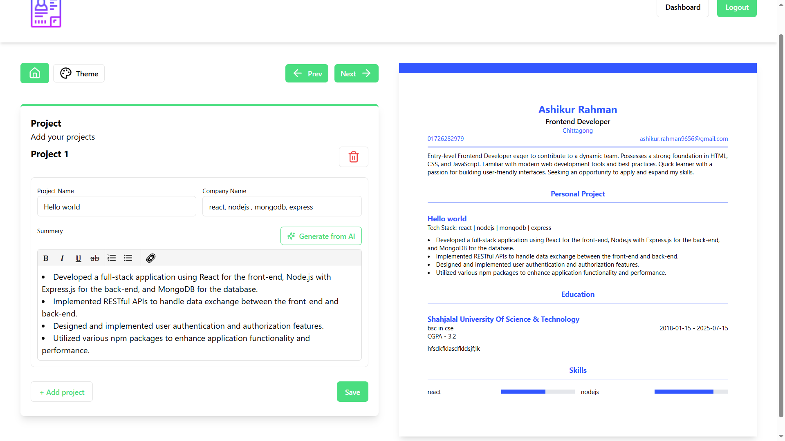
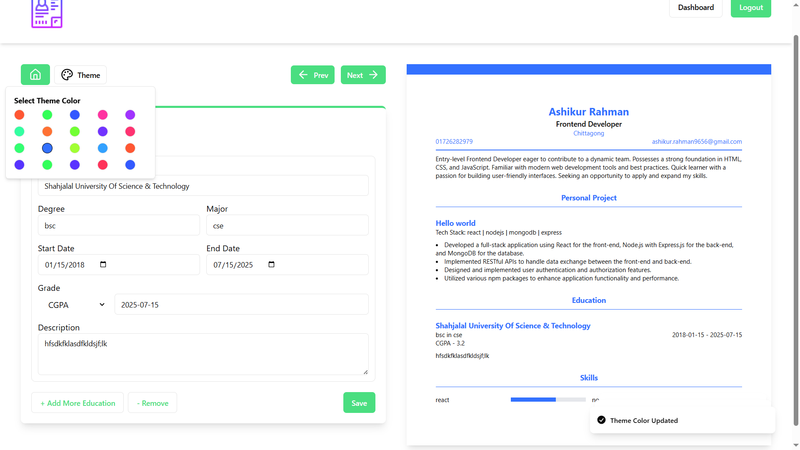
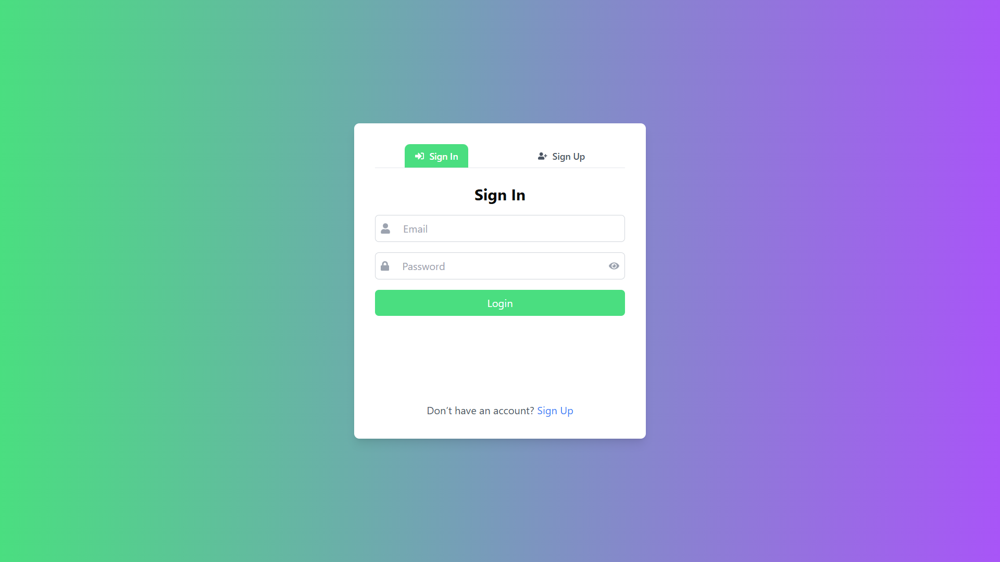

# 🧠 AI Resume Maker

AI Resume Maker is a modern and intelligent web application that helps users create job-ready resumes with ease. It combines a clean UI with AI-powered content suggestions and flexible resume management, making it ideal for students, professionals, and job seekers.

## Table of Contents

1. [Live](#live)
2. [Demo Video](#demo-video)
3. [Features](#features)
4. [Screenshots](#screenshots)
5. [Technologies Used](#technologies-used)
6. [Installation](#installation)

---

## Live

Check out the live website here: [https://ashikurs-ai-resume-maker.vercel.app/](https://ashikurs-ai-resume-maker.vercel.app/)

Its deployed in vercel and render.

---

## Demo Video

[](./images/ai-resume-maker_large.gif)  
_Click on the gif image to view it in a larger size._

---

## Features

- 🔐 **User Authentication**  
  Secure login system using JWT and bcrypt-based password encryption.

- 🏠 **Personal Dashboard**  
  View, edit, or manage **multiple saved resumes** — pick up where you left off anytime.

- 🎨 **Template Options**  
  Select from a variety of clean and modern templates for your resume.

- 🤖 **AI-Powered Suggestions**  
  Generate smart summaries tailored to your job title and experience level (Fresher, Mid, Senior) using Gemini AI.

- 🔍 **Live Preview**  
  Instantly see changes as you write — no need to refresh.

- 📄 **Export as PDF**  
  Download your final resume in professional PDF format.

---

## **Screenshots**

| Home Screen                     | dashboard                          | Ai summery suggestions                               |
| ------------------------------- | ---------------------------------- | ---------------------------------------------------- |
|  |  |  |

| Project Summery                                | change_theme                             | Login                      |
| ---------------------------------------------- | ---------------------------------------- | -------------------------- |
|  |  |  |

---

## Technologies Used

### Frontend

- React.js
- Tailwind CSS
- Redux Toolkit

### Backend

- Node.js
- Express.js

### Database

- MongoDB

### Integrations & Tools

- Gemini API (for AI summaries)
- JWT (authentication)

---

## Installation

1. **Clone the repository**:

   ```bash
   git clone https://github.com/AshikurRahman3/ai-resume-maker.git
   ```

2. **Install dependencies for client and server**

```bash
cd Frontend
npm install
```

```bash
cd Backend
npm install
```

3. **Set up environment variables in .env files**

frontend .env.local file:

```bash
VITE_GEMENI_API_KEY=your_gemini_api_key
VITE_APP_URL=http://localhost:5001/
```

Backend .env file:

```bash
MONGODB_URI=mongodb://localhost:27017/resumemakerai
PORT=5001
JWT_SECRET_KEY=secret_key
JWT_SECRET_EXPIRES_IN="1d"
NODE_ENV=Dev
ALLOWED_SITE=http://localhost:5173
```

4. **Start both frontend and backend**

```bash
cd Backend
npm run dev
```

```bash
cd Frontend
npm run dev
```

5. **Go to Website**

   [localhost:5173](http://localhost:5173)

## **Developer**

Developed by [Ashikur Rahman](https://github.com/AshikurRahman3).  
Feel free to explore my other projects on GitHub!
